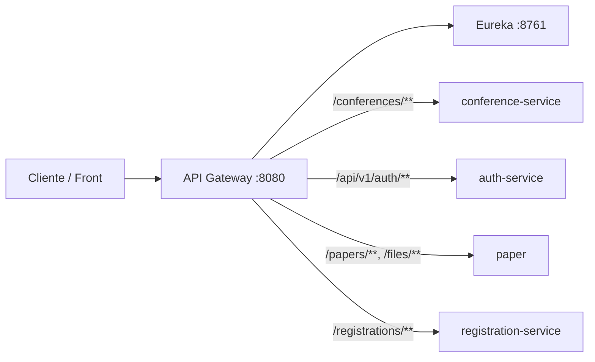

# API Gateway · Microservicios

Punto de entrada único para el ecosistema de microservicios: enruta el tráfico HTTP hacia los servicios internos según la ruta, sin exponer sus URLs directamente al cliente.

---

## Qué hace este proyecto

Este repositorio contiene un **API Gateway** construido con **Spring Cloud Gateway** (stack reactivo sobre **WebFlux**). Actúa como fachada: las peticiones llegan al gateway (por defecto en el puerto **8080**) y se reenvían al microservicio correspondiente según el prefijo de la URL.

El destino de cada ruta se resuelve vía **Eureka** y **Spring Cloud LoadBalancer** (`lb://<serviceId>`): el gateway consulta el registry y elige una instancia registrada bajo el `spring.application.name` de cada microservicio.

Ventajas típicas de este patrón:

- **Un solo origen** para el cliente (CORS, documentación, versionado).
- **Enrutado centralizado** y fácil de evolucionar cuando añades o cambias servicios.
- **Descubrimiento dinámico** sin URLs fijas por microservicio en el gateway.
- **Observabilidad** vía Spring Boot Actuator, Prometheus, Zipkin y logs de peticiones.

---

## Stack tecnológico

| Componente | Versión / elección |
|------------|-------------------|
| Java | 21 |
| Spring Boot | 4.0.x |
| Spring Cloud | 2025.1.x |
| Gateway | `spring-cloud-starter-gateway-server-webflux` |
| Service discovery | `spring-cloud-starter-netflix-eureka-client` |
| Load balancing | `spring-cloud-starter-loadbalancer` |
| Observabilidad | Spring Boot Actuator, Micrometer Prometheus, Zipkin |

---

## Rutas configuradas

Las rutas se definen en `src/main/resources/application.yml`. Cada destino usa `lb://` con el **serviceId** registrado en Eureka (`spring.application.name` del microservicio):

| Servicio (lógico) | Patrón de ruta | URI destino (`lb://`) |
|---------------------|----------------|------------------------|
| Conferencias | `/conferences/**` | `lb://conference-service` |
| Autenticación | `/api/v1/auth/**` | `lb://auth-service` |
| Papers / archivos | `/papers/**`, `/files/**` | `lb://paper` |
| Inscripciones | `/registrations/**` | `lb://registration-service` |
| Salas | `/rooms/**` | `lb://room` |
| Agenda | `/schedule/**` | `lb://schedule` |
| Notificaciones | `/notifications/**` | `lb://notification-service` |

Ejemplo: una petición a `http://localhost:8080/conferences/...` se proxifica a una instancia de `conference-service` descubierta en Eureka.



---

## Requisitos previos

- **JDK 21**
- **Maven** (o usar el wrapper incluido: `./mvnw`)
- **Eureka Server** en ejecución (por defecto `http://localhost:8761`) con los microservicios **registrados y UP** antes de enrutar tráfico real

---

## Configuración

### Variables de entorno

| Variable | Obligatoria | Uso |
|----------|-------------|-----|
| `EUREKA_SERVER_URL` | Sí | URL del registry Eureka, p. ej. `http://localhost:8761/eureka` |
| `ALLOWED_ORIGINS` | Sí | Origen permitido para CORS, p. ej. `http://localhost:5173` |

Variables opcionales de observabilidad:

| Variable | Valor por defecto | Uso |
|----------|-------------------|-----|
| `TRACING_SAMPLE_PROBABILITY` | `1.0` | Porcentaje de trazas a muestrear; `1.0` equivale al 100%. |
| `ZIPKIN_EXPORT_ENABLED` | `true` | Habilita o deshabilita el envío de trazas a Zipkin. |
| `ZIPKIN_ENDPOINT` | `http://127.0.0.1:9411/api/v2/spans` | Endpoint HTTP de Zipkin. |

Opcionalmente, el proyecto puede cargar un archivo **`.env`** en la raíz del proyecto (`spring.config.import: optional:file:.env[.properties]`). Si lo usas, define ahí las mismas variables sin commitear secretos al repositorio.

El gateway **no** usa variables `*_SERVICE_URL`: el enrutado depende exclusivamente de Eureka y los nombres `lb://` de la tabla anterior.

### Cliente Eureka en el gateway

El gateway consume el registry (`fetch-registry: true`) pero no se registra como instancia descubrible (`register-with-eureka: false`).

### Puerto

Por defecto el gateway escucha en **8080** (`server.port` en `application.yml`).

### CORS

La política CORS se configura globalmente para todas las rutas (`[/**]`):

- Origen permitido: valor exacto de `ALLOWED_ORIGINS`.
- Métodos permitidos: `GET`, `POST`, `PUT`, `PATCH`, `DELETE`, `OPTIONS`.
- Headers permitidos: cualquiera (`*`).
- Credenciales: habilitadas (`allowCredentials: true`).
- `maxAge`: 3600 segundos.

El filtro `DedupeResponseHeader` conserva el primer valor de `Access-Control-Allow-Origin` y `Access-Control-Allow-Credentials` cuando upstream y gateway devuelven cabeceras duplicadas.

---

## Cómo ejecutarlo

1. Arranca **Eureka Server** (puerto 8761).
2. Arranca los microservicios con `EUREKA_SERVER_URL` apuntando al mismo registry.
3. Arranca el gateway:

```bash
export EUREKA_SERVER_URL=http://localhost:8761/eureka
export ALLOWED_ORIGINS=http://localhost:5173

./mvnw spring-boot:run
```

O, tras empaquetar:

```bash
./mvnw package -DskipTests
java -jar target/api-gateway-0.0.1-SNAPSHOT.jar
```

Verifica en `http://localhost:8761` que los serviceIds (`auth-service`, `conference-service`, `paper`, etc.) aparecen como **UP**.

---

## Actuator (salud y gateway)

Están expuestos (entre otros) los endpoints:

- **Salud:** `GET /actuator/health`
- **Información:** `GET /actuator/info`
- **Rutas del gateway (solo lectura):** `GET /actuator/gateway`
- **Métricas Prometheus:** `GET /actuator/prometheus`

La configuración limita el acceso al endpoint `gateway` a **solo lectura** (`management.endpoint.gateway.access: read-only`). Las URIs de las rutas deben mostrarse como `lb://...`.

---

## Observabilidad operativa

### Logs de peticiones

`GatewayRequestLoggingFilter` es un `GlobalFilter` que se ejecuta con la mayor precedencia. Para cada petición:

1. Reutiliza la cabecera `X-Request-Id` si llega con valor no vacío; si no, genera un UUID.
2. Añade `X-Request-Id` a la petición que se reenvía al servicio destino.
3. Registra un log `INFO` al finalizar el intercambio con:
   - `requestId`
   - método HTTP
   - path solicitado
   - `routeId` resuelto por Spring Cloud Gateway, o `unmatched`
   - status HTTP, o `0` si la respuesta no llegó a fijarlo
   - duración en milisegundos
   - señal Reactor (`ON_COMPLETE`, `ON_ERROR`, `CANCEL`, etc.)

Ejemplo de línea de log:

```text
gateway request requestId=... method=GET path=/conferences routeId=conference-service status=200 durationMs=42 signal=...
```

Para emitir logs en JSON, ejecuta con el perfil Spring `json-logs`:

```bash
SPRING_PROFILES_ACTIVE=json-logs ./mvnw spring-boot:run
```

### Métricas del gateway

El filtro publica métricas Micrometer con tags `route.id`, `http.status` y `outcome`:

| Métrica | Tipo | Descripción |
|---------|------|-------------|
| `gateway.route.requests` | Counter | Cantidad de peticiones procesadas por ruta, estado y resultado Reactor. |
| `gateway.route.latency` | Timer | Latencia de peticiones procesadas por ruta, estado y resultado Reactor. |

El tag `outcome` puede ser `complete`, `error`, `cancel`, `unknown` o el nombre de la señal Reactor en minúsculas.

### Trazas

El proyecto incluye Zipkin. Por defecto intenta exportar trazas a `http://127.0.0.1:9411/api/v2/spans` y muestrea el 100% de las peticiones. Ajusta `ZIPKIN_EXPORT_ENABLED`, `ZIPKIN_ENDPOINT` y `TRACING_SAMPLE_PROBABILITY` según el entorno.

---

## Solución de problemas rápida

- **503 / No instances available for …:** el serviceId en `lb://` no coincide con `spring.application.name` en Eureka, o el microservicio no está registrado/UP. Revisa la tabla de rutas y el dashboard de Eureka.
- **La aplicación no arranca por placeholders sin resolver:** confirma `EUREKA_SERVER_URL` y `ALLOWED_ORIGINS` (o `.env`).
- **CORS falla con credenciales:** `ALLOWED_ORIGINS` debe ser un origen concreto; con `allowCredentials: true` no uses comodín `*`.
- **No aparecen trazas en Zipkin:** revisa que Zipkin esté disponible en `ZIPKIN_ENDPOINT` y que `ZIPKIN_EXPORT_ENABLED=true`.
- **Las rutas no coinciden:** consulta `GET /actuator/gateway` y valida que el path use uno de los prefijos configurados.

---

## Tests

```bash
EUREKA_SERVER_URL=http://localhost:8761/eureka \
ALLOWED_ORIGINS=http://localhost:5173 \
./mvnw test
```

---

*Proyecto de API Gateway para orquestar el acceso a microservicios mediante descubrimiento Eureka y balanceo `lb://`.*
