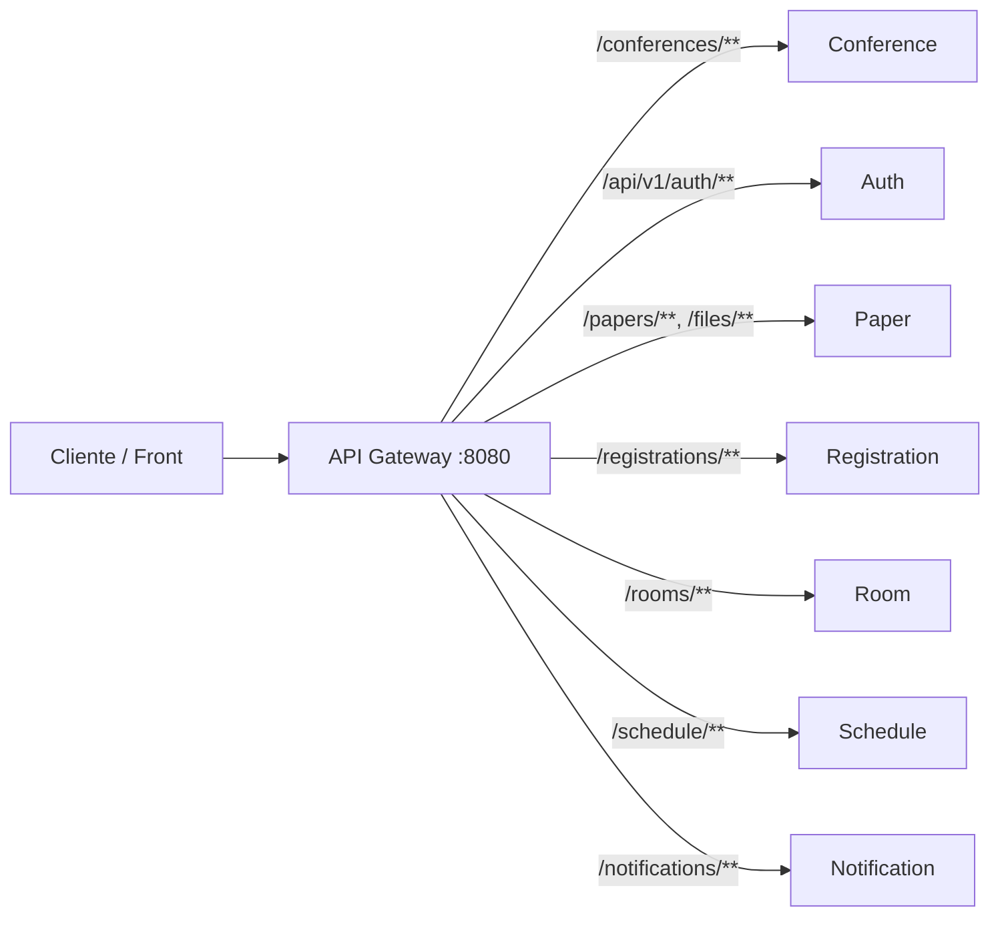

# API Gateway · Microservicios

Punto de entrada único para el ecosistema de microservicios: enruta el tráfico HTTP hacia los servicios internos según la ruta, sin exponer sus URLs directamente al cliente.

---

## Qué hace este proyecto

Este repositorio contiene un **API Gateway** construido con **Spring Cloud Gateway** (stack reactivo sobre **WebFlux**). Actúa como fachada: las peticiones llegan al gateway (por defecto en el puerto **8080**) y se reenvían al microservicio correspondiente según el prefijo de la URL.

Ventajas típicas de este patrón:

- **Un solo origen** para el cliente (CORS, documentación, versionado).
- **Enrutado centralizado** y fácil de evolucionar cuando añades o cambias servicios.
- **Observabilidad** vía Spring Boot Actuator, Prometheus, Zipkin y logs de peticiones.

---

## Stack tecnológico

| Componente | Versión / elección |
|------------|-------------------|
| Java | 21 |
| Spring Boot | 4.0.x |
| Spring Cloud | 2025.1.x |
| Gateway | `spring-cloud-starter-gateway-server-webflux` |
| Observabilidad | Spring Boot Actuator, Micrometer Prometheus, Zipkin |

---

## Rutas configuradas

Las rutas se definen en `src/main/resources/application.yml`. Resumen:

| Servicio (lógico) | Patrón de ruta | Variable de entorno (URI destino) |
|---------------------|----------------|-----------------------------------|
| Conferencias | `/conferences/**` | `CONFERENCE_SERVICE_URL` |
| Autenticación | `/api/v1/auth/**` | `AUTH_SERVICE_URL` |
| Papers / archivos | `/papers/**`, `/files/**` | `PAPER_SERVICE_URL` |
| Inscripciones | `/registrations/**` | `REGISTRATION_SERVICE_URL` |
| Salas | `/rooms/**` | `ROOM_SERVICE_URL` |
| Agenda | `/schedule/**` | `SCHEDULE_SERVICE_URL` |
| Notificaciones | `/notifications/**` | `NOTIFICATION_SERVICE_URL` |

Ejemplo: una petición a `http://localhost:8080/conferences/...` se proxifica al servicio de conferencias definido en `CONFERENCE_SERVICE_URL`.



---

## Requisitos previos

- **JDK 21**
- **Maven** (o usar el wrapper incluido: `./mvnw`)

---

## Configuración

### Variables de entorno

El gateway necesita las URLs base de cada microservicio (incluye esquema y host, por ejemplo `http://localhost:9001`):

| Variable | Uso |
|----------|-----|
| `CONFERENCE_SERVICE_URL` | Servicio de conferencias |
| `AUTH_SERVICE_URL` | Servicio de autenticación |
| `PAPER_SERVICE_URL` | Servicio de papers y archivos |
| `REGISTRATION_SERVICE_URL` | Servicio de inscripciones |
| `ROOM_SERVICE_URL` | Servicio de salas |
| `SCHEDULE_SERVICE_URL` | Servicio de agenda |
| `NOTIFICATION_SERVICE_URL` | Servicio de notificaciones |
| `ALLOWED_ORIGINS` | Origen permitido para CORS, por ejemplo `http://localhost:5173` |

Variables opcionales de observabilidad:

| Variable | Valor por defecto | Uso |
|----------|-------------------|-----|
| `TRACING_SAMPLE_PROBABILITY` | `1.0` | Porcentaje de trazas a muestrear; `1.0` equivale al 100%. |
| `ZIPKIN_EXPORT_ENABLED` | `true` | Habilita o deshabilita el envío de trazas a Zipkin. |
| `ZIPKIN_ENDPOINT` | `http://127.0.0.1:9411/api/v2/spans` | Endpoint HTTP de Zipkin. |

Opcionalmente, el proyecto puede cargar un archivo **`.env`** en la raíz del proyecto (`spring.config.import: optional:file:.env[.properties]`). Si lo usas, define ahí las mismas variables sin commitear secretos al repositorio.

### Puerto

Por defecto el gateway escucha en **8080** (`server.port` en `application.yml`).

### CORS

La política CORS se configura globalmente para todas las rutas (`[/**]`):

- Origen permitido: valor exacto de `ALLOWED_ORIGINS`.
- Métodos permitidos: `GET`, `POST`, `PUT`, `PATCH`, `DELETE`, `OPTIONS`.
- Headers permitidos: cualquiera (`*`).
- Credenciales: habilitadas (`allowCredentials: true`).
- `maxAge`: 3600 segundos.

El filtro `DedupeResponseHeader` conserva el primer valor de `Access-Control-Allow-Origin` y `Access-Control-Allow-Credentials` cuando upstream y gateway devuelven cabeceras duplicadas.

### Límite de memoria para cuerpos HTTP

`spring.codec.max-in-memory-size` está configurado en **50MB**. Este valor limita cuánto puede bufferizar WebFlux en memoria al procesar cuerpos HTTP; si una carga o respuesta supera ese tamaño, revisa el tamaño del payload antes de aumentarlo porque impacta el consumo de memoria del gateway.

---

## Cómo ejecutarlo

```bash
# Ejemplo, cambiar las urls y nombres de variables de entorno, según preferencia
export CONFERENCE_SERVICE_URL=http://localhost:9001
export AUTH_SERVICE_URL=http://localhost:9002
export PAPER_SERVICE_URL=http://localhost:9003
export REGISTRATION_SERVICE_URL=http://localhost:9004
export ROOM_SERVICE_URL=http://localhost:9005
export SCHEDULE_SERVICE_URL=http://localhost:9006
export NOTIFICATION_SERVICE_URL=http://localhost:9007
export ALLOWED_ORIGINS=http://localhost:5173

./mvnw spring-boot:run
```

O, tras empaquetar:

```bash
./mvnw package -DskipTests
java -jar target/api-gateway-0.0.1-SNAPSHOT.jar
```

---

## Actuator (salud y gateway)

Están expuestos (entre otros) los endpoints:

- **Salud:** `GET /actuator/health`
- **Información:** `GET /actuator/info`
- **Rutas del gateway (solo lectura):** `GET /actuator/gateway`
- **Métricas Prometheus:** `GET /actuator/prometheus`

La configuración limita el acceso al endpoint `gateway` a **solo lectura** (`management.endpoint.gateway.access: read-only`).

---

## Observabilidad operativa

### Logs de peticiones

`GatewayRequestLoggingFilter` es un `GlobalFilter` que se ejecuta con la mayor precedencia. Para cada petición:

1. Reutiliza la cabecera `X-Request-Id` si llega con valor no vacío; si no, genera un UUID.
2. Añade `X-Request-Id` a la petición que se reenvía al servicio destino.
3. Registra un log `INFO` al finalizar el intercambio con:
   - `requestId`
   - método HTTP
   - path solicitado
   - `routeId` resuelto por Spring Cloud Gateway, o `unmatched`
   - status HTTP, o `0` si la respuesta no llegó a fijarlo
   - duración en milisegundos
   - señal Reactor (`ON_COMPLETE`, `ON_ERROR`, `CANCEL`, etc.)

Ejemplo de línea de log:

```text
gateway request requestId=... method=GET path=/conferences routeId=conference-service status=200 durationMs=42 signal=...
```

Para emitir logs en JSON, ejecuta con el perfil Spring `json-logs`:

```bash
SPRING_PROFILES_ACTIVE=json-logs ./mvnw spring-boot:run
```

### Métricas del gateway

El filtro publica métricas Micrometer con tags `route.id`, `http.status` y `outcome`:

| Métrica | Tipo | Descripción |
|---------|------|-------------|
| `gateway.route.requests` | Counter | Cantidad de peticiones procesadas por ruta, estado y resultado Reactor. |
| `gateway.route.latency` | Timer | Latencia de peticiones procesadas por ruta, estado y resultado Reactor. |

El tag `outcome` puede ser `complete`, `error`, `cancel`, `unknown` o el nombre de la señal Reactor en minúsculas.

### Trazas

El proyecto incluye Zipkin. Por defecto intenta exportar trazas a `http://127.0.0.1:9411/api/v2/spans` y muestrea el 100% de las peticiones. Ajusta `ZIPKIN_EXPORT_ENABLED`, `ZIPKIN_ENDPOINT` y `TRACING_SAMPLE_PROBABILITY` según el entorno.

---

## Solución de problemas rápida

- **La aplicación no arranca por placeholders sin resolver:** confirma que todas las variables obligatorias (`*_SERVICE_URL` y `ALLOWED_ORIGINS`) estén definidas o presentes en `.env`.
- **CORS falla con credenciales:** `ALLOWED_ORIGINS` debe ser un origen concreto; con `allowCredentials: true` no uses comodín `*`.
- **No aparecen trazas en Zipkin:** revisa que Zipkin esté disponible en `ZIPKIN_ENDPOINT` y que `ZIPKIN_EXPORT_ENABLED=true`.
- **Las rutas no coinciden:** consulta `GET /actuator/gateway` y valida que el path use uno de los prefijos configurados.
- **Payloads grandes fallan en WebFlux:** el gateway bufferiza hasta 50MB por `spring.codec.max-in-memory-size`; reduce el tamaño del cuerpo o ajusta ese valor evaluando memoria disponible.

---

## Tests

```bash
CONFERENCE_SERVICE_URL=http://localhost:9001 \
AUTH_SERVICE_URL=http://localhost:9002 \
PAPER_SERVICE_URL=http://localhost:9003 \
REGISTRATION_SERVICE_URL=http://localhost:9004 \
ROOM_SERVICE_URL=http://localhost:9005 \
SCHEDULE_SERVICE_URL=http://localhost:9006 \
NOTIFICATION_SERVICE_URL=http://localhost:9007 \
ALLOWED_ORIGINS=http://localhost:5173 \
./mvnw test
```

---

*Proyecto de API Gateway para orquestar el acceso a microservicios de conferencias, autenticación, papers, inscripciones, salas, agenda y notificaciones.*
