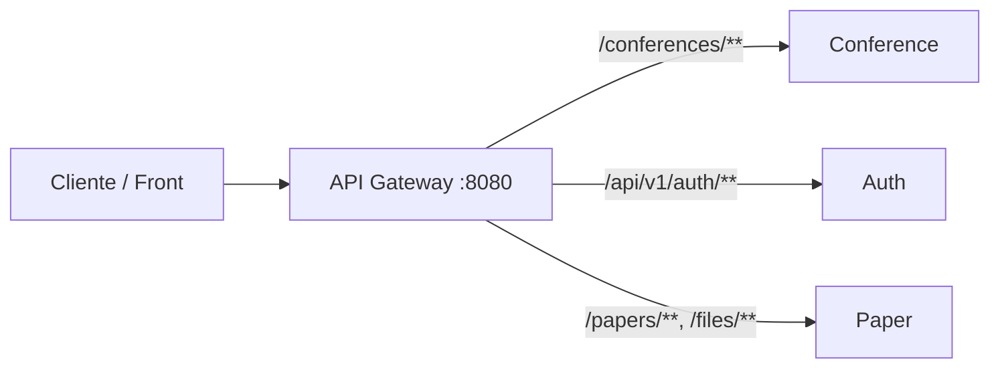

# API Gateway · Microservicios

Punto de entrada único para el ecosistema de microservicios: enruta el tráfico HTTP hacia los servicios internos según la ruta, sin exponer sus URLs directamente al cliente.

---

## Qué hace este proyecto

Este repositorio contiene un **API Gateway** construido con **Spring Cloud Gateway** (stack reactivo sobre **WebFlux**). Actúa como fachada: las peticiones llegan al gateway (por defecto en el puerto **8080**) y se reenvían al microservicio correspondiente según el prefijo de la URL.

Ventajas típicas de este patrón:

- **Un solo origen** para el cliente (CORS, documentación, versionado).
- **Enrutado centralizado** y fácil de evolucionar cuando añades o cambias servicios.
- **Observabilidad** básica vía Spring Boot Actuator (salud, metadatos y rutas del gateway).

---

## Stack tecnológico

| Componente | Versión / elección |
|------------|-------------------|
| Java | 21 |
| Spring Boot | 4.0.x |
| Spring Cloud | 2025.1.x |
| Gateway | `spring-cloud-starter-gateway-server-webflux` |
| Observabilidad | Spring Boot Actuator |

---

## Rutas configuradas

Las rutas se definen en `src/main/resources/application.yml`. Resumen:

| Servicio (lógico) | Patrón de ruta | Variable de entorno (URI destino) |
|---------------------|----------------|-----------------------------------|
| Conferencias | `/conferences/**` | `CONFERENCE_SERVICE_URL` |
| Autenticación | `/api/v1/auth/**` | `AUTH_SERVICE_URL` |
| Papers / archivos | `/papers/**`, `/files/**` | `PAPER_SERVICE_URL` |

Ejemplo: una petición a `http://localhost:8080/conferences/...` se proxifica al servicio de conferencias definido en `CONFERENCE_SERVICE_URL`.



---

## Requisitos previos

- **JDK 21**
- **Maven** (o usar el wrapper incluido: `./mvnw`)

---

## Configuración

### Variables de entorno

El gateway necesita las URLs base de cada microservicio (incluye esquema y host, por ejemplo `http://localhost:9001`):

| Variable | Uso |
|----------|-----|
| `CONFERENCE_SERVICE_URL` | Servicio de conferencias |
| `AUTH_SERVICE_URL` | Servicio de autenticación |
| `PAPER_SERVICE_URL` | Servicio de papers y archivos |

Opcionalmente, el proyecto puede cargar un archivo **`.env`** en la raíz del proyecto (`spring.config.import: optional:file:.env[.properties]`). Si lo usas, define ahí las mismas variables sin commitear secretos al repositorio.

### Puerto

Por defecto el gateway escucha en **8080** (`server.port` en `application.yml`).

---

## Cómo ejecutarlo

```bash
# Compilar y arrancar (ajusta las URLs a tu entorno)
export CONFERENCE_SERVICE_URL=http://localhost:9001
export AUTH_SERVICE_URL=http://localhost:9002
export PAPER_SERVICE_URL=http://localhost:9003

./mvnw spring-boot:run
```

O, tras empaquetar:

```bash
./mvnw package -DskipTests
java -jar target/api-gateway-0.0.1-SNAPSHOT.jar
```

---

## Actuator (salud y gateway)

Están expuestos (entre otros) los endpoints:

- **Salud:** `GET /actuator/health`
- **Información:** `GET /actuator/info`
- **Rutas del gateway (solo lectura):** `GET /actuator/gateway`

La configuración limita el acceso al endpoint `gateway` a **solo lectura** (`management.endpoint.gateway.access: read-only`).

---

## Tests

```bash
./mvnw test
```

---

*Proyecto de API Gateway para orquestar el acceso a microservicios de conferencias, autenticación y papers.*
